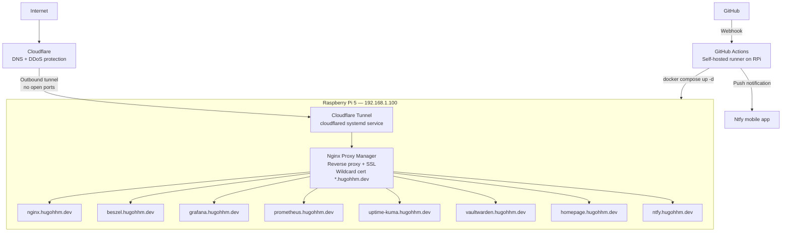
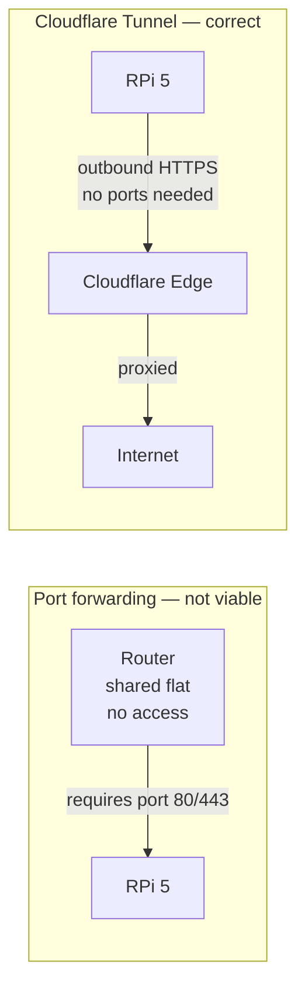
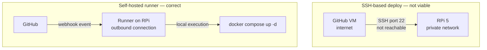
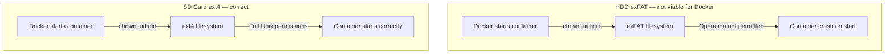
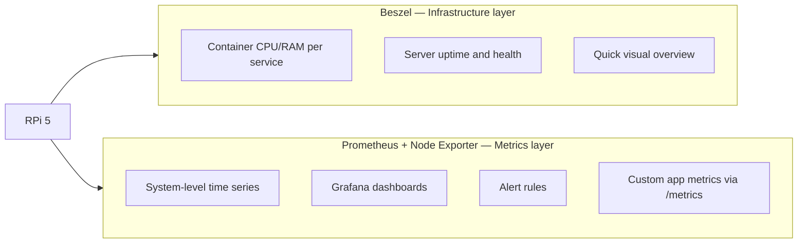
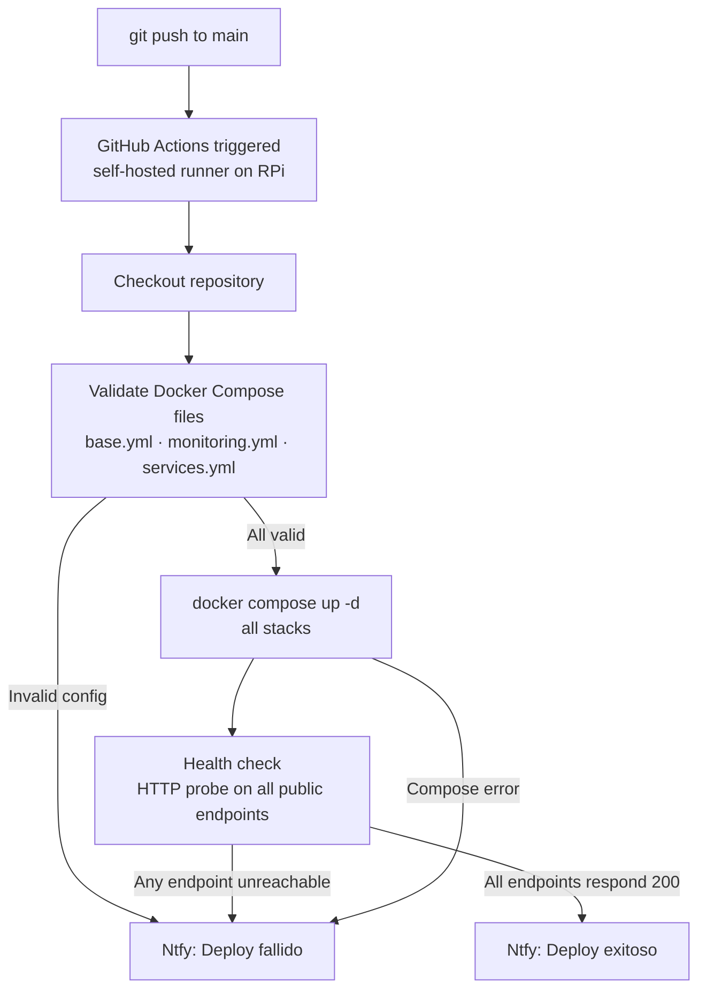

<div align="center">

# Homelab

**Personal homelab on Raspberry Pi 5 — infrastructure as code, GitOps, and self-hosted services.**

[](https://ubuntu.com/server)
[](https://www.docker.com/)
[](https://www.raspberrypi.com/)
[](https://www.cloudflare.com/)
[](https://github.com/features/actions)
[](LICENSE)

> *If it's not in the repo, it doesn't exist.*

</div>

---

## Table of Contents

- [Quick Start](#quick-start)
- [Hardware](#hardware)
- [Architecture](#architecture)
- [Stack](#stack)
- [Key Decisions](#key-decisions)
- [Subdomains](#subdomains)
- [Storage Strategy](#storage-strategy)
- [CI/CD Pipeline](#cicd-pipeline)
- [Repo Structure](#repo-structure)
- [Phases](#phases)

---

## Quick Start

> [!NOTE]
> This homelab runs on a Raspberry Pi 5 (ARM64). All Docker images must support `linux/arm64`.

> [!IMPORTANT]
> The HDD must be formatted as **ext4** for Docker volumes. exFAT does not support Unix permissions — containers will crash on start.

> [!WARNING]
> Never commit `.env`. It contains secrets. Use `.env.example` as a template.

```bash
# 1. Clone the repository
git clone git@github.com:HuguitoH/Homelab.git
cd homelab

# 2. Create your environment file
cp .env.example .env
# Edit .env with your values — see .env.example for reference

# 3. Start base infrastructure (Nginx Proxy Manager)
docker compose -f docker-compose/base.yml --env-file .env up -d

# 4. Start observability stack
docker compose -f docker-compose/monitoring.yml --env-file .env up -d

# 5. Start personal services
docker compose -f docker-compose/services.yml --env-file .env up -d
```

| Command | Description |
|---------|-------------|
| `docker compose -f docker-compose/base.yml --env-file .env up -d` | Start Nginx Proxy Manager |
| `docker compose -f docker-compose/monitoring.yml --env-file .env up -d` | Start observability stack |
| `docker compose -f docker-compose/services.yml --env-file .env up -d` | Start personal services |
| `docker compose -f docker-compose/base.yml --env-file .env down` | Stop a stack |
| `docker ps` | Check running containers |
| `docker logs <container>` | View container logs |

---

## Hardware

| Component | Details |
|-----------|---------|
| Board | Raspberry Pi 5 8GB |
| Architecture | **ARM64 (aarch64)** — Cortex-A76 |
| Case | Argon NEO 5 BRED |
| OS Storage | SD Card 64GB (ext4) |
| Data Storage | HDD 1TB USB 3.0 (exFAT — limitation documented below) |
| Network | WiFi 5GHz — Cloudflare Tunnel for external access |
| OS | Ubuntu Server 24.04.4 LTS |

> [!NOTE]
> ARM64 constraint: not all Docker images support `linux/arm64`. This is a real constraint when selecting services — always check before adding a new one.

---

## Architecture



---

## Stack

### Infrastructure
| Tool | Version | Purpose |
|------|---------|---------|
| Ubuntu Server | 24.04.4 LTS | Base OS — production-grade, ARM64 native |
| Docker Engine | 29.3.1 | Container orchestration |
| Docker Compose | v5.1.1 | Multi-container management |
| Nginx Proxy Manager | latest | Reverse proxy + automatic SSL |
| Cloudflare Tunnel | 2026.3.0 | External access — zero open ports |
| Glances | latest | System resource API for Homepage widgets |

### Observability
| Tool | Purpose |
|------|---------|
| Beszel | Server + container monitoring dashboard |
| Prometheus | Metrics collection and storage |
| Node Exporter | System metrics (CPU, RAM, disk, network) |
| Grafana | Dashboards — Node Exporter Full (ID 1860) |
| Loki | Log aggregation |
| Promtail | Log collector (Docker + system logs) |
| Uptime Kuma | Service availability + status page |

### DevOps
| Tool | Purpose |
|------|---------|
| GitHub Actions | CI/CD pipeline |
| Self-hosted runner | Runs pipeline directly on RPi (ARM64, outbound only) |
| Ntfy | Push notifications on deploy success/failure |

### Services
| Service | Purpose |
|---------|---------|
| Pi-hole | Network-level DNS ad-blocking |
| Vaultwarden | Self-hosted Bitwarden password manager |
| Homepage | Unified dashboard with live service widgets |
| Ntfy | Self-hosted push notification server |
| Jellyfin | Media server *(pending content)* |

---

## Key Decisions

### Cloudflare Tunnel over port forwarding



Cloudflare Tunnel establishes an **outbound-only** connection. No ports need to be opened on the router — the only viable solution in a shared flat without router access. Bonus: automatic HTTPS, DDoS protection, and a free wildcard SSL certificate.

---

### Self-hosted GitHub Actions runner over SSH deploy



The RPi has no public IP. SSH from GitHub's VMs would require exposing port 22 — against the zero-open-ports principle. The self-hosted runner connects **outbound** to GitHub (same pattern as Cloudflare Tunnel). It also executes natively on ARM64.

---

### SD Card for Docker volumes over HDD



**exFAT does not support Unix permissions** (chown, chmod, symlinks). Docker containers require ownership changes on their data directories:

| Container | Required UID |
|-----------|-------------|
| Prometheus | 65534 |
| Grafana | 472 |
| Loki | 10001 |

All fail silently on exFAT. Docker volumes live on SD card (ext4). HDD reserved for Jellyfin media and backups.

**Planned:** Migration to NVMe SSD (ext4) — eliminates this constraint entirely.

---

### Ubuntu Server over Raspberry Pi OS

| | Ubuntu Server 24.04 | Raspberry Pi OS |
|---|---|---|
| LTS support | Until 2029 | Rolling |
| ARM64 | Full 64-bit | 32/64-bit mixed |
| Docker support | Official, native | Community |
| Production parity | Same as real servers | Different |
| Package ecosystem | Full Debian/Ubuntu | Limited |

Ubuntu Server is what runs in production. Using it locally means zero surprises when working with real infrastructure.

---

### Two monitoring layers — Beszel and Prometheus



Beszel gives a fast visual overview. Prometheus feeds Grafana for detailed time-series analysis and alerting. Different layers, different responsibilities — keeping both is intentional.

---

## Subdomains

| Subdomain | Service | Port | SSL |
|-----------|---------|------|-----|
| nginx.hugohhm.dev | Nginx Proxy Manager | 81 | Wildcard |
| beszel.hugohhm.dev | Beszel | 8090 | Wildcard |
| grafana.hugohhm.dev | Grafana | 3000 | Wildcard |
| prometheus.hugohhm.dev | Prometheus | 9090 | Wildcard |
| uptime-kuma.hugohhm.dev | Uptime Kuma | 3001 | Wildcard |
| vaultwarden.hugohhm.dev | Vaultwarden | 8181 | Wildcard |
| homepage.hugohhm.dev | Homepage | 3002 | Wildcard |
| ntfy.hugohhm.dev | Ntfy | 8080 | Wildcard |
| *(local only)* | Pi-hole | 8082 | HTTP |

SSL: Let's Encrypt wildcard `*.hugohhm.dev` via DNS challenge (Cloudflare API token).

---

## Storage Strategy

```
Raspberry Pi 5
│
├── SD Card 64GB (ext4)
│   ├── /                       Ubuntu Server root filesystem
│   ├── /opt/docker/            ALL Docker data volumes (ext4 required)
│   │   ├── nginx/              Nginx PM config + Let's Encrypt certs
│   │   ├── beszel/             Beszel PocketBase database
│   │   ├── beszel-agent/       Agent state
│   │   ├── prometheus/         Metrics TSDB (30d retention)
│   │   ├── grafana/            Dashboards + datasource config
│   │   ├── loki/               Log storage
│   │   ├── uptime-kuma/        Monitor config + history
│   │   ├── vaultwarden/        Encrypted password vault
│   │   ├── homepage/           YAML config files
│   │   └── ntfy/               Notification cache
│   └── ~/actions-runner/       GitHub Actions runner binary
│
└── HDD 1TB USB (exFAT) — /mnt/hdd
    ├── docker/                 Reserved for future heavy volumes
    ├── personal/               Personal files
    └── backups/                Homelab backups

Constraint: exFAT has no Unix permissions support.
Docker volumes must stay on ext4 (SD card).
Planned upgrade: NVMe SSD via USB 3.0 enclosure (ext4).
```

> [!CAUTION]
> Do not move Docker volumes to the HDD. exFAT will silently break container startup with `Operation not permitted` errors on `chown`.

---

## CI/CD Pipeline

> **v1** — validate, deploy, health check, notify.



**Health checks (post-deploy):**

```bash
curl -sf https://nginx.hugohhm.dev
curl -sf https://grafana.hugohhm.dev
curl -sf https://beszel.hugohhm.dev
curl -sf https://uptime-kuma.hugohhm.dev
curl -sf https://homepage.hugohhm.dev
curl -sf https://vaultwarden.hugohhm.dev
curl -sf https://ntfy.hugohhm.dev
```

**Planned for v2:**
- Automatic rollback on health check failure
- Trivy security scan on Docker images
- Sandbox environment on `develop` branch
- Diun for Docker image update notifications

---

## Repo Structure

```
homelab/
├── .github/
│   └── workflows/
│       └── deploy.yml         # CI/CD — validate, deploy, health check, notify
├── docker-compose/
│   ├── base.yml               # Nginx Proxy Manager
│   ├── monitoring.yml         # Beszel, Prometheus, Grafana, Loki,
│   │                          # Uptime Kuma, Node Exporter, Glances
│   └── services.yml           # Pi-hole, Vaultwarden, Homepage, Ntfy
├── prometheus/
│   └── prometheus.yml         # Scrape targets
│                              # Note: IP hardcoded — Prometheus does not
│                              # support env var substitution natively
├── grafana/
│   └── dashboards/            # Dashboard JSON exports
├── scripts/                   # Backup and maintenance scripts (planned)
├── .env.example               # Required env vars — no values committed
├── .gitignore                 # .env always excluded
└── README.md
```

---

## Phases

- [x] **Phase 1** — Base infrastructure
  - Ubuntu Server 24.04 on RPi 5 (ARM64)
  - Docker 29.3.1 + Compose v5.1.1
  - Static IP 192.168.1.100
  - Cloudflare Tunnel (zero open ports)
  - Nginx Proxy Manager + Let's Encrypt wildcard SSL
  - Domain: hugohhm.dev

- [x] **Phase 2** — Observability stack
  - Beszel server + container monitoring
  - Prometheus + Node Exporter system metrics
  - Grafana Node Exporter Full dashboard
  - Loki + Promtail log aggregation
  - Uptime Kuma service availability
  - Glances resource API

- [x] **Phase 3** — DevOps
  - GitHub Actions self-hosted runner (ARM64, outbound only)
  - CI/CD pipeline — validate + deploy + health check + notify
  - Ntfy self-hosted push notifications

- [x] **Phase 4** — Personal services
  - Pi-hole DNS ad-blocker (local network)
  - Vaultwarden self-hosted password manager
  - Homepage dashboard with live service widgets and Docker status

- [ ] **Phase 5** — AI layer *(planned)*
  - Ollama local LLM inference
  - agent-ops infrastructure assistant
  - agent-dev Socratic code reviewer
  - agent-teacher learning companion

---

<div align="center">

*Built and maintained by [Hugo Hernández](https://github.com/HuguitoH) — backend engineering student, Madrid.*

</div>
